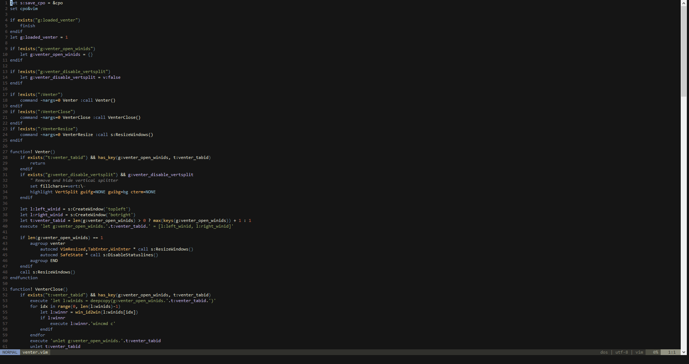
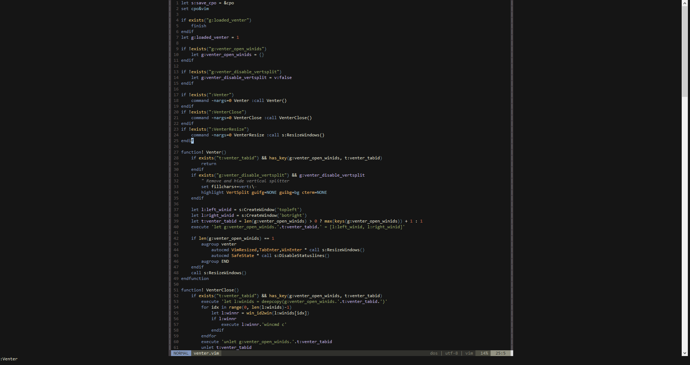

# venter.vim

Vim plugin to vertically center the current window(s)

This is mainly useful when working with one file on a large monitor

Similar to [goyo.vim](https://github.com/junegunn/goyo.vim) but keeps the functionality (statusbar, tabline etc.)

## How to Use

### Commands

`:Venter` - Open venter

`:VenterClose` - Open venter

`:VenterResize` - Force a window resize (usually only happens on VimResized, TabEnter and WinEnter events)

### Options

`g:venter_disable_vertsplit` - Set to `v:true` before calling `:Venter` to disable the vertical window separators

`g:venter_width` - Manually set width of padding windows (defaults to `&columns/4`)

## Screenshots

### Before

### After

