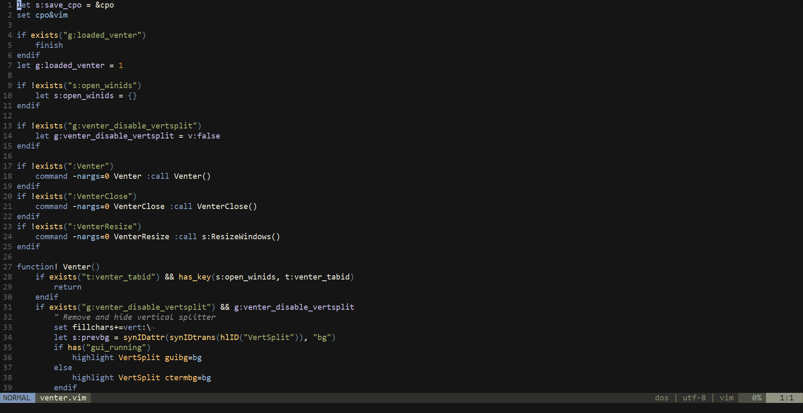

# vim-venter

vim-venter is a vim plugin that ~~vertically~~ horizontally centers the current window(s)

This is mainly useful when working with one file on a large monitor

Similar to [goyo.vim](https://github.com/junegunn/goyo.vim) but keeps the functionality (statusbar, tabline etc.)

## Installation

#### vim-plug

Add `Plug 'jmckiern/vim-venter'` to .vimrc  
Then run `:PlugInstall` in vim

#### Vundle.vim

Add `Plugin 'jmckiern/vim-venter'` to .vimrc  
Then run `:PluginInstall` in vim

#### Pathogen

Run `git clone https://github.com/jmckiern/vim-venter ~/.vim/bundle/vim-venter` in a terminal

## How to Use

### Commands

`:Venter` - Open venter

`:VenterClose` - Close venter

`:VenterToggle` - Toggle venter

`:VenterResize` - Force a window resize (usually only happens on VimResized, TabEnter and WinEnter events)

### Options

`g:venter_disable_vertsplit` - Set to `v:true` before calling `:Venter` to disable the vertical window separators

`g:venter_width` - Manually set width of padding windows (defaults to `&columns/4`)

`g:venter_close_tab_if_empty` - Close the tab when the final window is closed if there are other tabs open (defaults to `v:true`)
